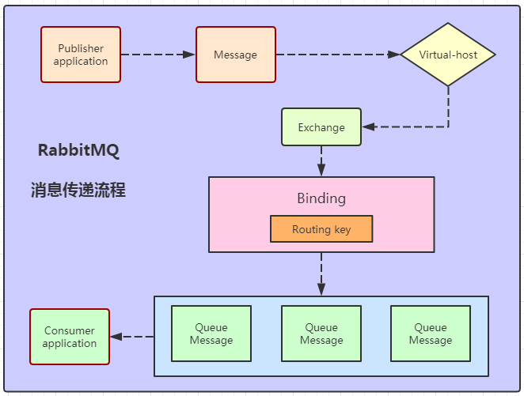

# Springboot2.X 整合RabbitMq 实现消息持久化

## 一、RabbitMQ 简介
官方推出的六种模式
### 1.1 "Hello World!" 

######`简单模式 一对一生产消费`
### 1.2 Work Queues

######`一个生产者对应多个消费队列`
###### `默认情况下，RabbitMQ将按顺序将每条消息发送给下一个消费者。平均而言，每个消费者将获得相同数量的消息`
### 1.3 Publish/Subscribe

######`订阅发布：多个队列订阅一个交换机，每个队列都会接收到自己订阅的交换机`
### 1.4 Routing

######`路由模式：对消息进行过滤，把控消费队列获取消息的信息量`
### 1.5 Topics

###### 订阅发布
### 二、AMQP模式

## 三、MQ应用场景
### 场景说明：
 ### 2.1用户注册后，需要发注册邮件和注册短信,传统的做法有两种
 ###### (1)串行方式:将注册信息写入数据库后,发送注册邮件,再发送注册短信,以上三个任务全部完成后才返回给客户端。
 ###### 这有一个问题是,邮件,短信并不是必须的,它只是一个通知,而这种做法让客户端等待没有必要等待的东西. `
 
###### (2)并行方式:将注册信息写入数据库后,发送邮件的同时,发送短信,以上三个任务完成后,
###### 返回给客户端,并行的方式能提高处理的时间。 `
 
###### 假设三个业务节点分别使用50ms,串行方式使用时间150ms,并行使用时间100ms。
###### 虽然并性已经提高的处理时间,但是,前面说过,邮件和短信对我正常的使用网站没有任何影响，
###### 客户端没有必要等着其发送完成才显示注册成功,英爱是写入数据库后就返回.  
###### (3)消息队列 
###### 引入消息队列后，把发送邮件,短信不是必须的业务逻辑异步处理 `
 
###### 由此可以看出,引入消息队列后，用户的响应时间就等于写入数据库的时间+写入消息队列的时间(可以忽略不计),引入消息队列后处理后,响应时间是串行的3倍,是并行的2倍。`

### 2.2 应用解耦
    场景：双11是购物狂节,用户下单后,订单系统需要通知库存系统,传统的做法就是订单系统调用库存系统的接口. 
 
###### 这种做法有一个缺点:
    1.当库存系统出现故障时,订单就会失败。
    2.订单系统和库存系统高耦合. `
###### 引入消息队列

###### 订单系统:用户下单后,订单系统完成持久化处理,将消息写入消息队列,返回用户订单下单成功。
###### 库存系统:订阅下单的消息,获取下单消息,进行库操作。 
###### 就算库存系统出现故障,消息队列也能保证消息的可靠投递,不会导致消息丢失。
### 2.3流量削峰
流量削峰一般在秒杀活动中应用广泛 
    场景:秒杀活动，一般会因为流量过大，导致应用挂掉,为了解决这个问题，一般在应用前端加入消息队列。 
###### 作用: 
    1.可以控制活动人数，超过此一定阀值的订单直接丢弃(我为什么秒杀一次都没有成功过呢^^) 
    2.可以缓解短时间的高流量压垮应用(应用程序按自己的最大处理能力获取订单) 
     
###### 1.用户的请求,服务器收到之后,首先写入消息队列,加入消息队列长度超过最大值,则直接抛弃用户请求或跳转到错误页面. 
###### 2.秒杀业务根据消息队列中的请求信息，再做后续处理.
######原文链接：https://blog.csdn.net/qq_38455201/article/details/80308771

### 四、RabbitMQ 消息传递流程

2019090914591336.png
## 五、RabbitMQ可靠性投递，防止重复消费设计

## SQL 
案例sql在doc下SQL小的mysqlinit.sql内
## 配置介绍
    rabbitmq:
      addresses: ip+port
      username: name
      password: pwd
      #虚拟主机(一个RabbitMQ服务可以配置多个虚拟主机，
      #每一个虚拟机主机之间是相互隔离，相互独立的，
      #授权用户到指定的virtual-host就可以发送消息到指定队列)
      virtual-host: dev
      publisher-returns: true #返回确认
      publisher-confirms: true # 成功确认
      ## 消费端配置
      listener:
        simple:
          concurrency: 1 # 最小消费者数量
          acknowledge-mode: manual #手动消费，默认是自动消费
          max-concurrency: 10 # 最大消费者数量
          prefetch: 1
          retry:
            enabled: true     #是否支持重试 默认支持

### 注 Auto
    1. 如果消息成功被消费（成功的意思是在消费的过程中没有抛出异常），则自动确认
    2. 当抛出 AmqpRejectAndDontRequeueException 异常的时候，则消息会被拒绝，且 requeue = false（不重新入队列）
    3. 当抛出 ImmediateAcknowledgeAmqpException 异常，则消费者会被确认
    4. 其他的异常，则消息会被拒绝，且 requeue = true，此时会发生死循环，可以通过 setDefaultRequeueRejected（默认是true）去设置抛弃消息
    5. 如设置成manual手动确认，一定要对消息做出应答，否则rabbit认为当前队列没有消费完成，将不再继续向该队列发送消息。
    6. channel.basicAck(long,boolean); 确认收到消息，消息将被队列移除，false只确认当前consumer一个消息收到，true确认所有consumer获得的消息。
    7. channel.basicNack(long,boolean,boolean); 确认否定消息，第一个boolean表示一个consumer还是所有，第二个boolean表示requeue是否重新回到队列，true重新入队。
    8. channel.basicReject(long,boolean); 拒绝消息，requeue=false 表示不再重新入队，如果配置了死信队列则进入死信队列。
    9. 当消息回滚到消息队列时，这条消息不会回到队列尾部，而是仍是在队列头部，这时消费者会又接收到这条消息，如果想消息进入队尾，须确认消息后再次发送消息。